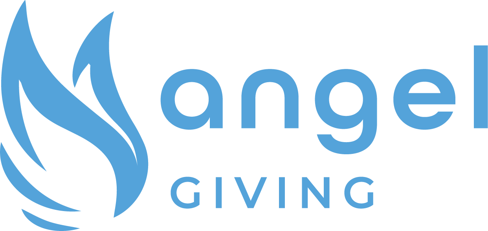

# Angel Giving

[https://angelgiving.io/](https://angelgiving.io/)

On-chain Endowments & Fundraising Marketplace

## About

Angel Giving provides nonprofits across the world with free access to their own endowment and a marketing page on a global charity marketplace. Donations are directed to a NPO’s AST account and automatically invested in low-risk, high-yielding products made possible by blockchain technologies. Every week, a portion of the interest from those DeFi products is sent to the charity and the remainder is automatically reinvested, compounding in perpetuity to provide sustainable funding.
Angel Giving is a global team of individuals with backgrounds in philanthropy and technology, passionate about building a world where humanity is empowered with the financial security to solve our grand challenges. Their incredible community raised over $6 million dollars in donations to more than 160 charities, with $1.5M raised to fight climate change, $500k in humanitarian relief for those impacted by Typhoon Rai, and over $200k to support Ukrainian refugees.

## Goals

- Democratize access to financial opportunity for nonprofits so they can enjoy financial sustainability regardless of their size, resources, or location
- Ensure all nonprofits have access to a free fundraising profile and embeddable donation widget on their site 
- Promote charitable giving on-chain and connect giving partners to beneficiary NPOs
- Provide donors access to on-chain DAFs to donate and manage tokenized assets 

## Parameters

Angel Giving integrates AST functionality directly into their front end and utilizes a registration process to onboard NPOs. That registration process allows NPOs to create pre-configured ASTs designed to work as endowments, and generates a fundraising marketplace page where the NPO can be discovered on Angel Giving’s marketplace. The marketplace front end is open-sourced and available to leverage for the creation of similar or modified products. Below are the pre-configured and adjustable parameters for NPOs:

**Admin Wallet:** Default multisig created for each NPO initially using the registration wallet

**Admin Settings:** Set by NPO

**Locked and Liquid Settings:** Chosen by donor on marketplace (defaulted to 100% locked), or chosen by NPO during widget creation

**Fees:** No additional fees added, Angel Giving seeks to be a cost leader to be an inclusive as possible for financially strained NPOs

**Donor Verification:** Set by NPO

**Investments:** A preset plan is devised to automatically send 75% of yield generated within Locked funds to Liquid
 
