# Functionality Examples

## Simple Multisig

The default setup for AST on creation is a multisig (i.e. Admin Wallet). This is the simplest form of an AST. At any time, the owners of ASTs can opt-in for tokenized governance with either an existing token or by creating a new token. At the moment of the opt-in, the owners can decide which parameters of the AST fall under the governance and which are still controlled by the native multi-sig.

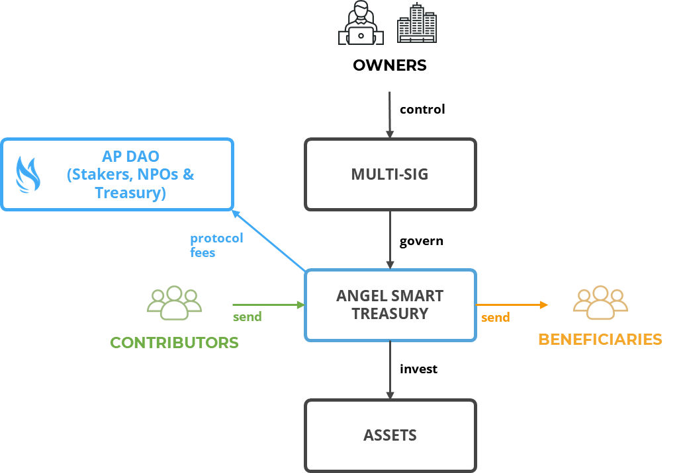

## Existing Token

When the owners of an AST decide to opt-in for DAO governance using an existing token, a governance contract is instantiated that allows token holders to vote on the parameters that have been chosen by the contract owner.

Eligible tokens are pre-approved by the AP DAO along with a designated AMM token pair contract address that is used to convert fees from the AST (generally denominated in stablecoins) into the token in use for distribution to stakers as rewards.

The owners of an AST can instantiate a Matching contract that contains a reserve of tokens that are distributed to contributors following a set of rules defined by the governance of the AST.

A Rewards contract can also be instantiated that enables using a reserve of tokens to increase staking rewards.

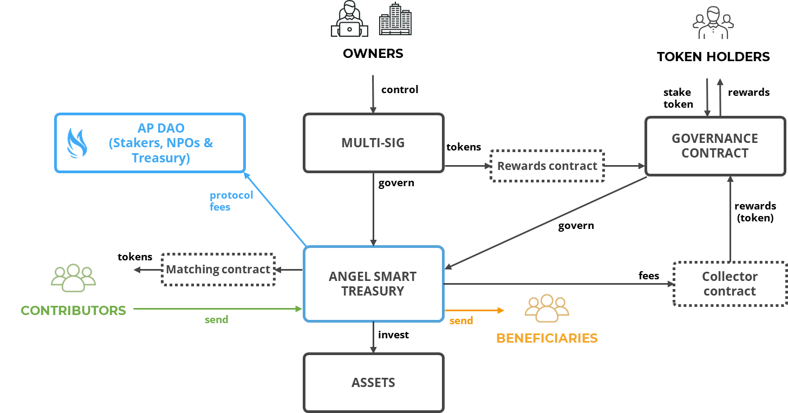

## New Token Setup

### Fixed Supply

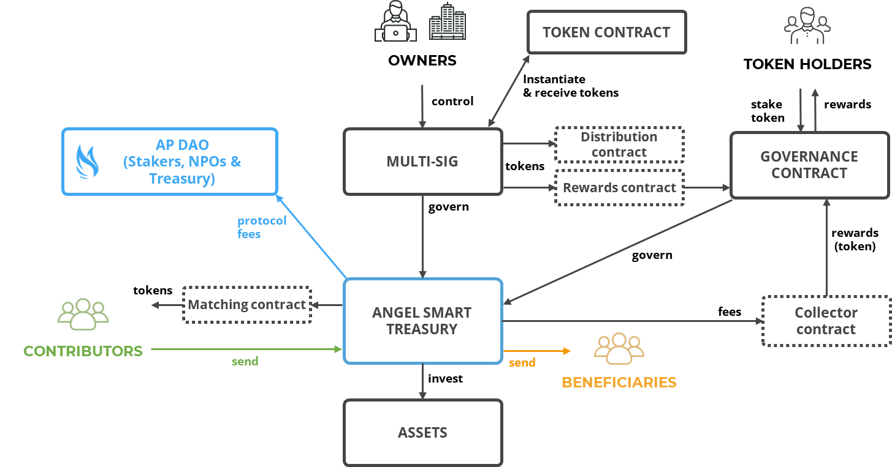

### Bonding Curve

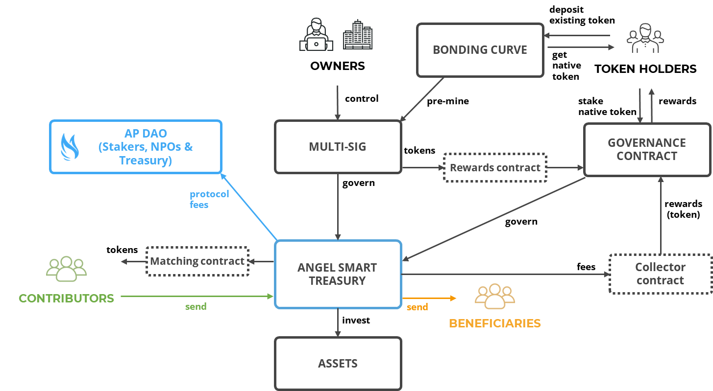

## Simple Personal Endowment

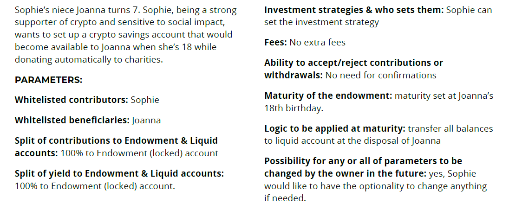
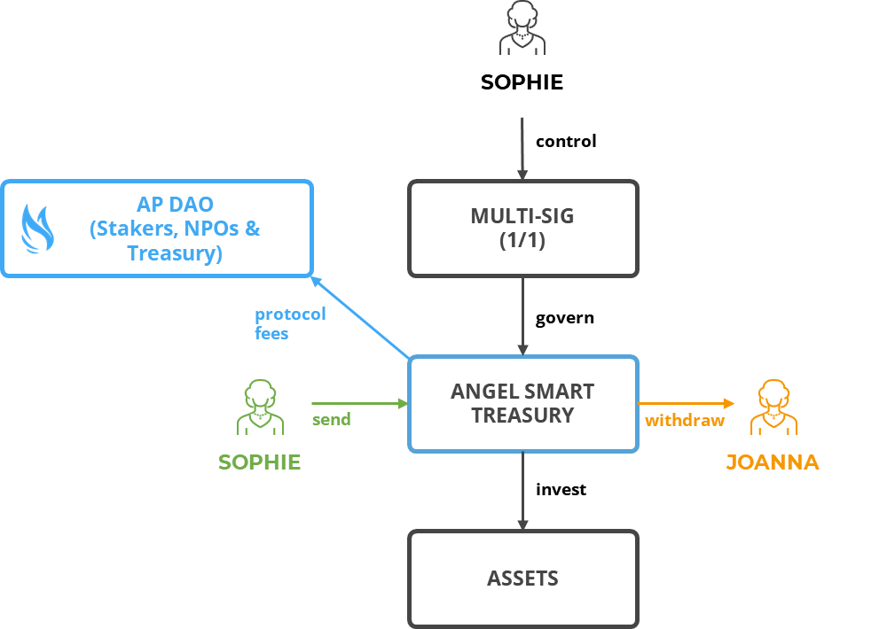

## Charitable Estate Planning Trust

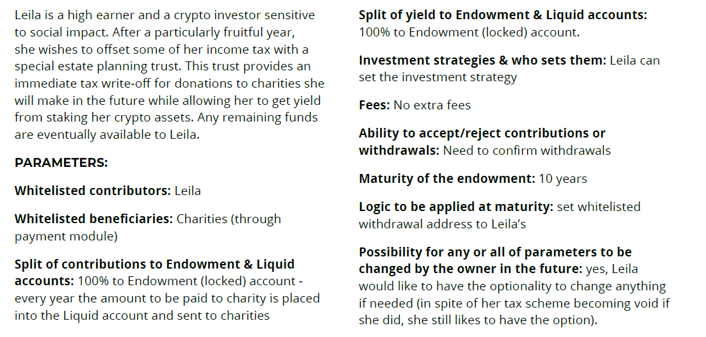
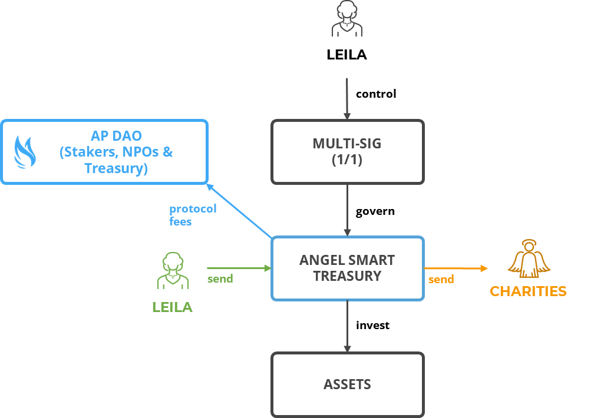

## Employee Pension Plan

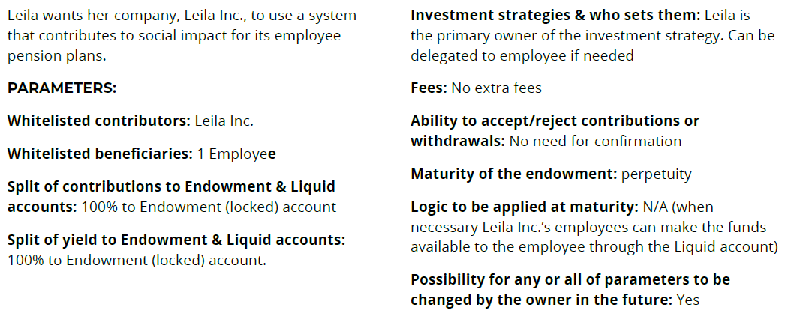
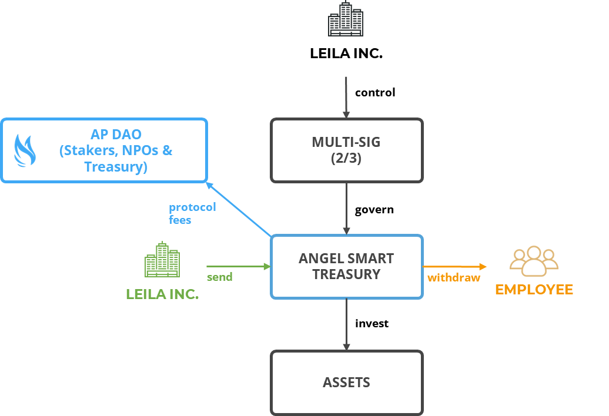

## Social Impact Fund

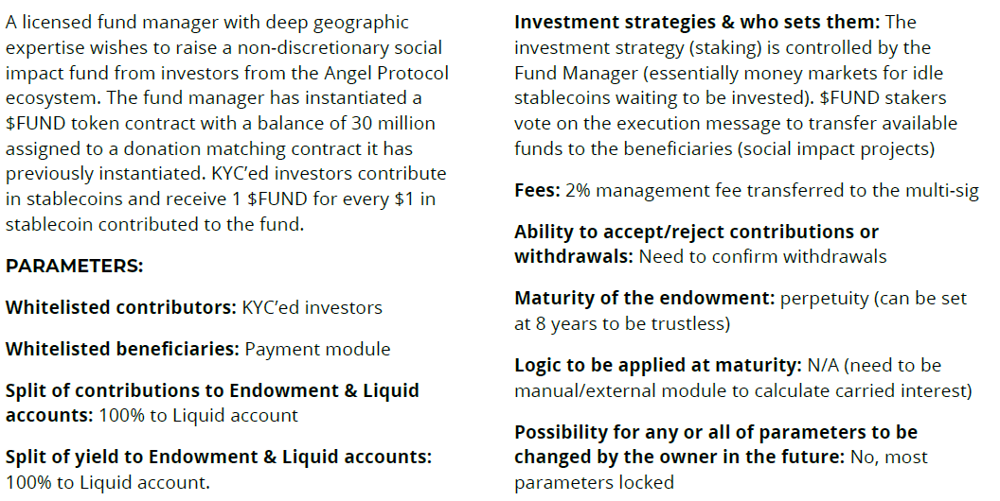
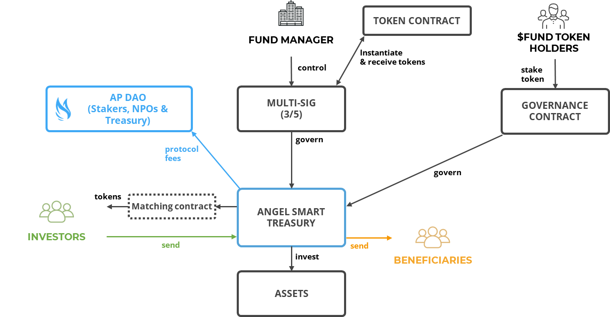

## Lossless Impact Group

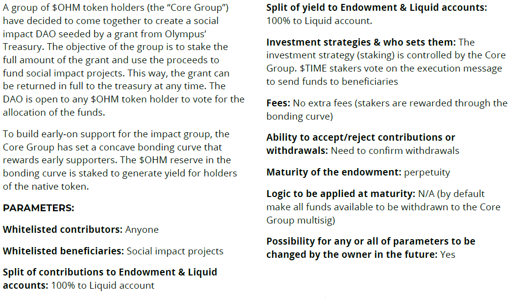
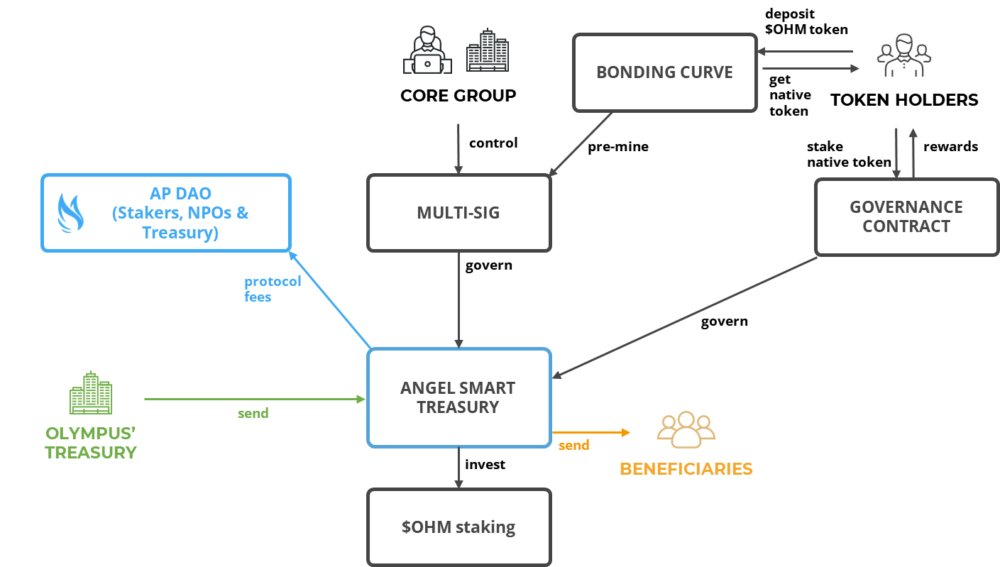

## Social Impact Collective

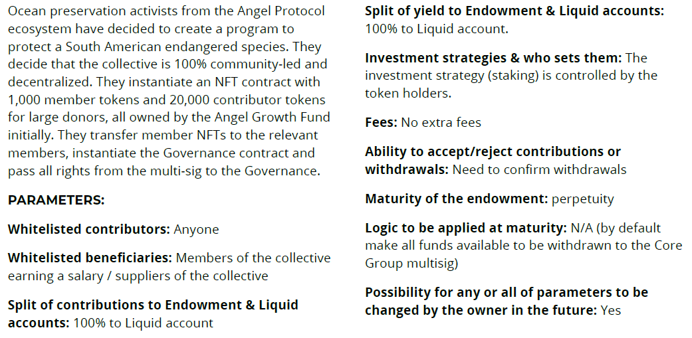
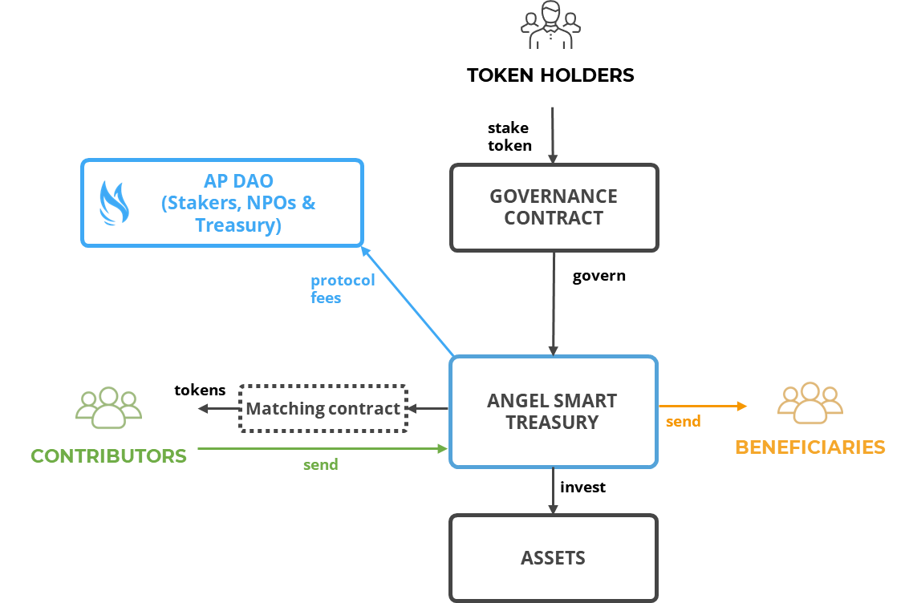

