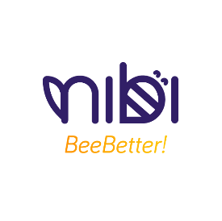

# Nibi

Corporate Social Responsibility in LATAM

## About

Nibi is a tech platform supporting over 250 grassroots Colombian nonprofits with marketing, fundraising, and capacity building. Nibi seeks to build trust in the burgeoning CSR space in LATAM while also opening up financial rails to seamlessly accept global donations.

## Goals

- Implement a smooth front-end API to increase donor and funder access globally in fiat and cryptocurrency
- Transparently manage global donations for their respective clients
- Demonstrate the benefits of an endowment for their grassroots nonprofit clients

## Parameters

**Admin Wallet:**  Multi-sig set up consisting of four members from Nibi’s team. Each will have equal voting weight. Nibi will be the sole holder of all keys within the AST, as they will manage all financials for their clients.

**Admin Settings:** 75% (3/4) vote for execution, 72 hours for voting window, and auto execution on.

**Whitelists:**
- Contributors: ‘Anyone’ can fund Nibi’s AST
- Beneficiaries: Mirror of the admin wallet multi-sig holders. As Nibi’s clients are grassroots nonprofits with limited access to technology, Nibi will act as the custodian on their behalf managing all financial flows. 

**Maturity:** None. Nibi will manage financial flows on an ad-hoc basis, immediately sending donations for their respective receiving client.

**Fees:** 2%. Nibi manages donor engagement and increases the amount of funds for their clients, for this they will administer a 2% fee on all funds managed. This is in addition to the 20% of revenue Nibi will share from base Angel Protocol fees.

**Donor Verification:** On, Donor Verification will be required for funding Nibi’s AST. This enables Nibi to manage and strengthen donor relationships. 

**Permissions:** Nibi will lock forever a majority of their parameters. Delegate will have access to change Nibi’s profile, but all other decisions will be in control of the Admin wallet.

**Investments:** A preset plan is devised to automatically send 75% of yield generated on Locked funds to Liquid. Additionally any funds donated to the Locked account will auto invest into a stablecoin pool to maximize risk reward for sustained funding.
	