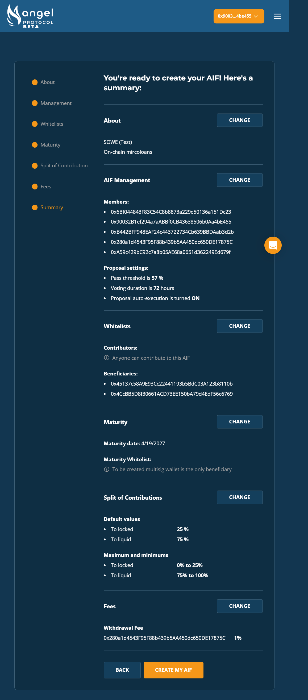

# SOWE

On-chain Microfinance

## About

SOWE and their field partner Yamba Hearts for Uganda empower women to start their own businesses with zero interest loans provided by global donors. SOWE seeks to remove any intermediaries in directly funding women entrepreneurs while also establishing an evergreen fund to offset any loan defaults.

## Goals

- Pool funds from around the world to support local entrepreneurs
- Embed transparency in loan origination and repayment
- Create a robust evergreen fund with the automated Investment and Locked features

## Parameters

**Admin Wallet:** Multi-sig set up consisting of three members from SOWE’s team and two members from Yamba Hearts for Uganda. As the Yamba Hearts for Uganda team works directly with the loan applicants, their vote will be weighted 2:1 compared to SOWE’s team.

**Admin Settings:** Approximately 57% (4/7) vote for execution, 72 hours for voting window, and auto execution on.

**Whitelists:**
- Contributors: ‘Anyone’ can fund SOWE’s AST
- Beneficiaries: This will be expanded on a rolling basis. The Admin wallet team will help loan recipients with wallet set-up and for each approved loan, a new beneficiary will be added to the whitelist. 

**Maturity:** None. SOWE will manage loans on a rolling basis. In the future, rewards for repaying loans on-time could receive a programmed bonus at maturity of loan cycle.

**Locked and Liquid Settings:** Default is set to 75% Liquid. This allows for 25% to continue to generate yield to off-set any risk of loan default.

**Fees:** 1%. SOWE will charge a 1% fee to support their ongoing operational costs. This is in addition to the 20% of revenue SOWE will share from base Angel Protocol fees.

**Donor Verification:** Off, KYC will not be required to support women entrepreneurs in Uganda. 

**Permissions:** SOWE will experiment with locking a few features while keeping a majority flexible as they gain familiarity with the platform.

**Investments:** A preset plan is devised to automatically send 25% of yield generated on Locked funds to Liquid. SOWE would like to build a robust evergreen fund and will keep a majority of Locked funds within the Locked account for emergency use. Additionally any funds donated to the Locked account will auto invest into a stablecoin pool to maximize risk reward for sustained funding.
