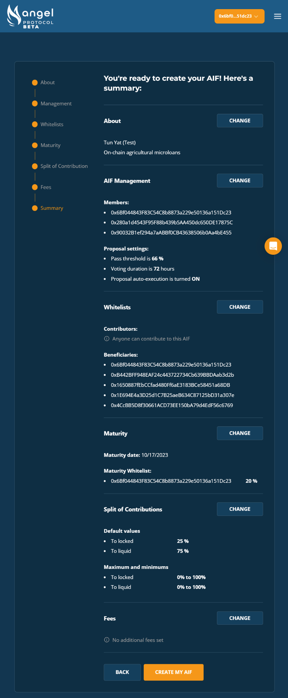

# Tun Yat

On-chain Agricultural Microloans

## About

Tun Yat provides credit facilities for smallholder farmers with limited financing options in Myanmar. Servicing over 5,000 farmers to date Tun Yat is seeking to transparently scale their loan portfolio with the utmost capital efficiency.

## Goals

- Pool funds from around the world given local political and economic challenges
- Remove middlemen by building on-chain farmer credit profiles to directly connect farmers to funders
- Invest in curated tokenized assets to cover ongoing OPEX costs
- Pilot smart-contract based decisions with auto execution of loan decisions

## Parameters

Tun Yat provides credit facilities for smallholder farmers with limited financing options in Myanmar. Servicing over 5,000 farmers to date Tun Yat is seeking to transparently scale their loan portfolio with the utmost capital efficiency.

**Admin Wallet:**  Multi-sig set up consisting of three members from Tun Yat’s headquarters. Each will have equal voting weight. In the future, Village Committees receiving loans will be given admin wallet access and an equal vote for ongoing funding decisions. 

**Admin Settings:** 66% (2/3) vote for execution, 72 hours for voting window, and auto execution on.

**Whitelists:**
- Contributors: ‘Anyone’ can fund Tun Yat’s AST 
- Beneficiaries: Vetted Village Committees are the only participants eligible to receive funds from Tun Yat, plus an additional Tun Yat OPEX wallet to maintain clarity in financial flows

**Maturity:** Every six months, 20% of Locked funds go to OPEX wallet. This enables a sustainable business model as yield will help offset ongoing OPEX costs.

**Locked and Liquid Settings:** Default is set to 75% Liquid to fund ongoing agricultural microloans, but donors can customize this to their preferences.

**Fees:** No additional fees will be charged as Tun Yat is not passing any additional costs to their farmer clients

**Donor Verification:** Off, no KYC required for funding Tun Yat’s AST

**Permissions:** Tun Yat will keep all settings unlocked as they become more comfortable with the dynamics of ASTs. Delegate will have access to change Tun Yat’s profile but all other decisions will be in control of the Admin wallet.

**Investments:** A preset plan is devised to automatically send 50% of yield generated within Locked funds to Liquid. Additionally, any funds donated to the Locked account will auto invest into a stablecoin pool to maximize risk reward for sustained funding.
 
