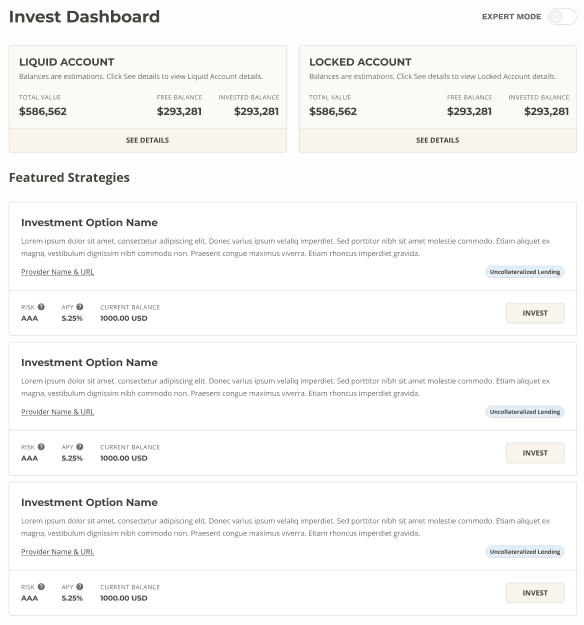

# Investments

## Invest Dashboard

The invest dashboard lets you see your current account balances along with investment options. You can drill into details around the liquid & locked accounts, select investments, and toggle expert mode to see a complete list of investment opportunities.

## Locked & Liquid Accounts

The Liquid & Locked account details will allow you to see your specific balances, performance history, and investment positions.

## Transferring 
You can transfer funds from the Liquid to the Locked account by selecting `VIEW ALL` in your Liquid Account Free Balances Overview and then choosing `TRANSFER ASSETS`.

## Investing into a Strategy

When you click `INVEST` on a strategy, you will be able to see more details about the investment and choose the account to invest from:

You will be prompted to confirm before executing the transaction.

## Redeeming from a Strategy

To redeem your investments, simply navigate to the Liquid or Locked account and click `REDEEM` on the strategy you are ready to exit.

