# Configuring Your Angel Smart Treasury

> **What You Will Learn:** 
> - How to manage your AST (Decision Center & Whitelists)
> - Updating settings (Admin Wallet, Donor Verification & Permission)

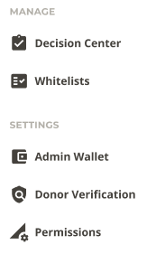

## Decision Center 

The decision center is where all requests must be voted on to be approved or rejected. You can expand requests to see additional details, then simply click the approve or reject icon accordingly. Requests may include updating AST settings or taking various actions within the AST, such as making investments or updating the profile. You will be asked to confirm before proceeding.

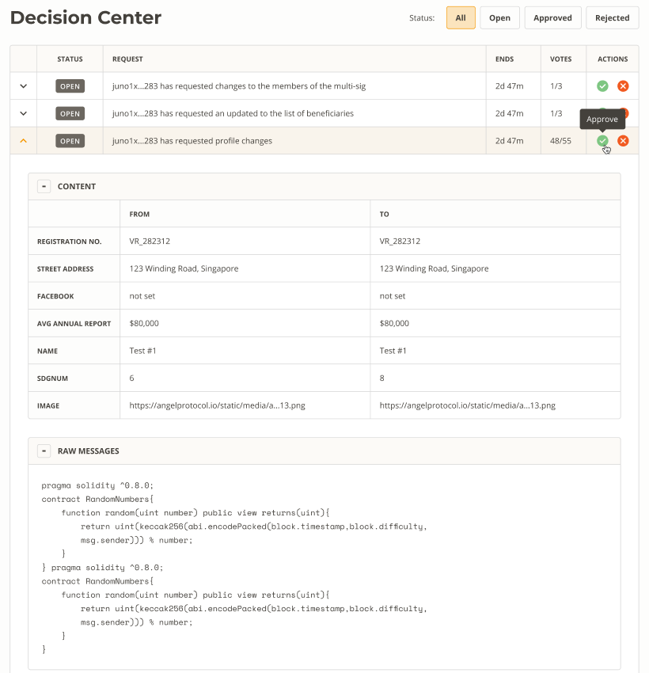

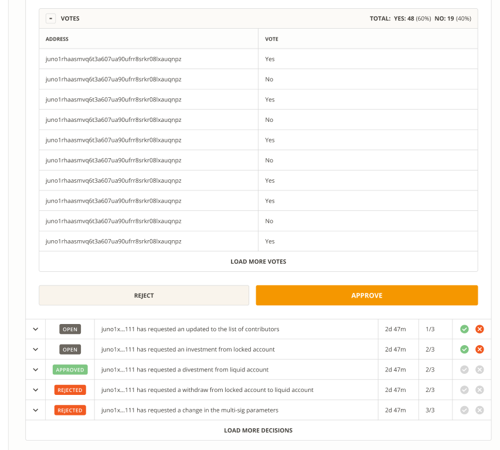

## Whitelists

If you’d like to review or update contributor or beneficiary whitelist settings, you may do so here. Adding or removing contributors and beneficiaries is as easy as clicking the relevant icon to remove or add:

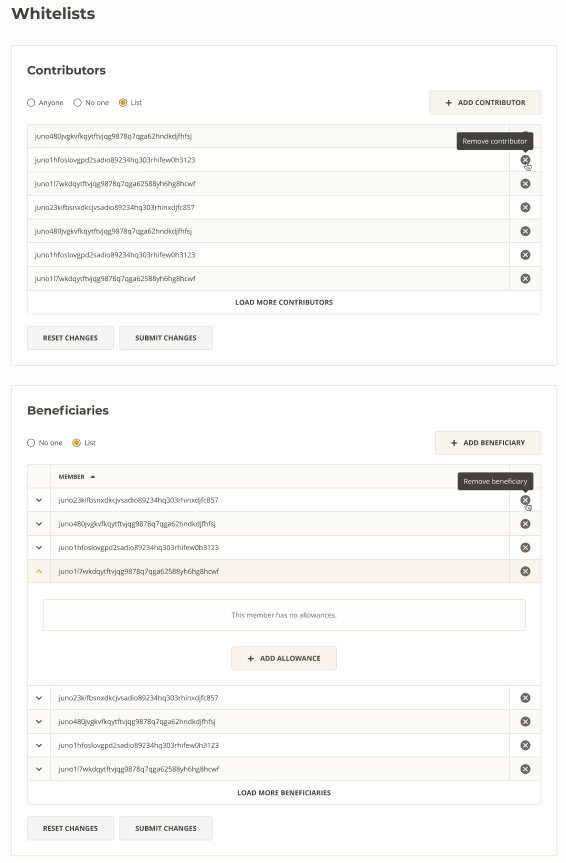

## Allowances

You may also add, update, or remove allowances here.
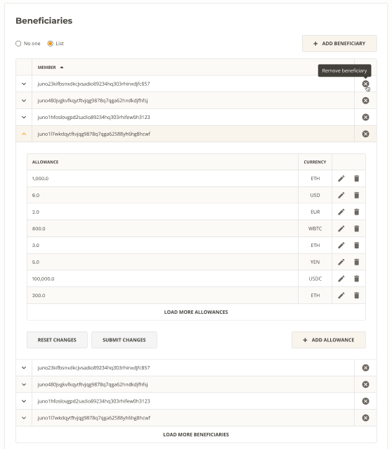

When adding or updating, you can select the relevant currency for the allowance.

### Adding Allowances

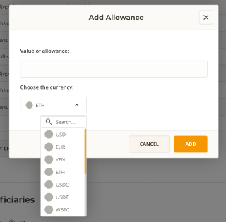

### Updating Allowances
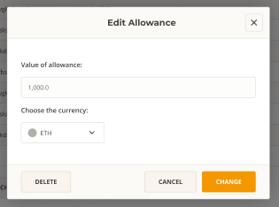

## Admin Wallet

The Admin Wallet controls your AST and is comprised of the members you’ve selected. You can add and remove members here along with changing their voting weight. You can also adjust settings related to the proposal process such as # of members required to vote, duration, and auto-execution toggle.

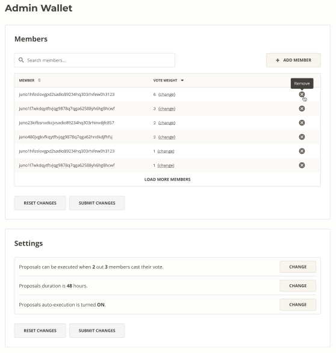

## Donor Verification

If your AST is operating as a nonprofit or DAF you may choose to toggle donor verification on or off in this section.

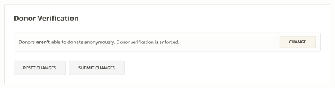

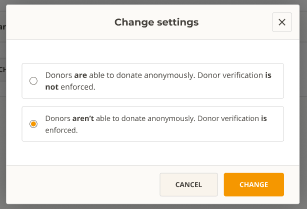

## Permissions

This is where you can update who has permission to change or access different aspects of your AST. You can toggle between Admin Wallet or Delegate Wallets, and update delegates. You may also lock settings permanently. 

>  ⚠️ **Warning:** Locking settings permanently is ***irreversible***!

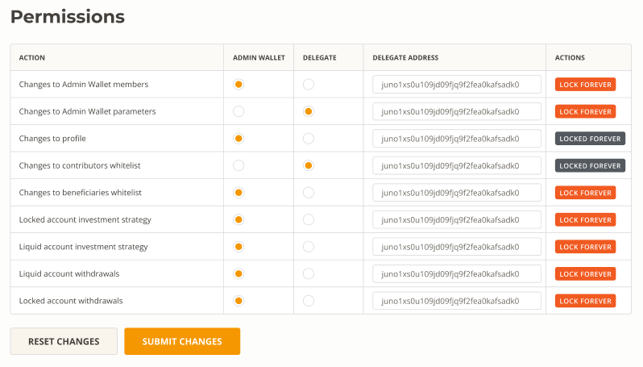