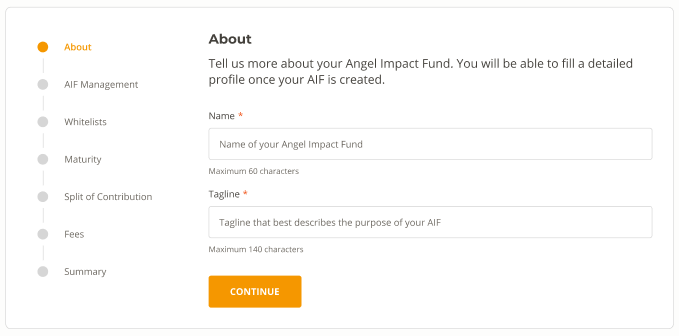
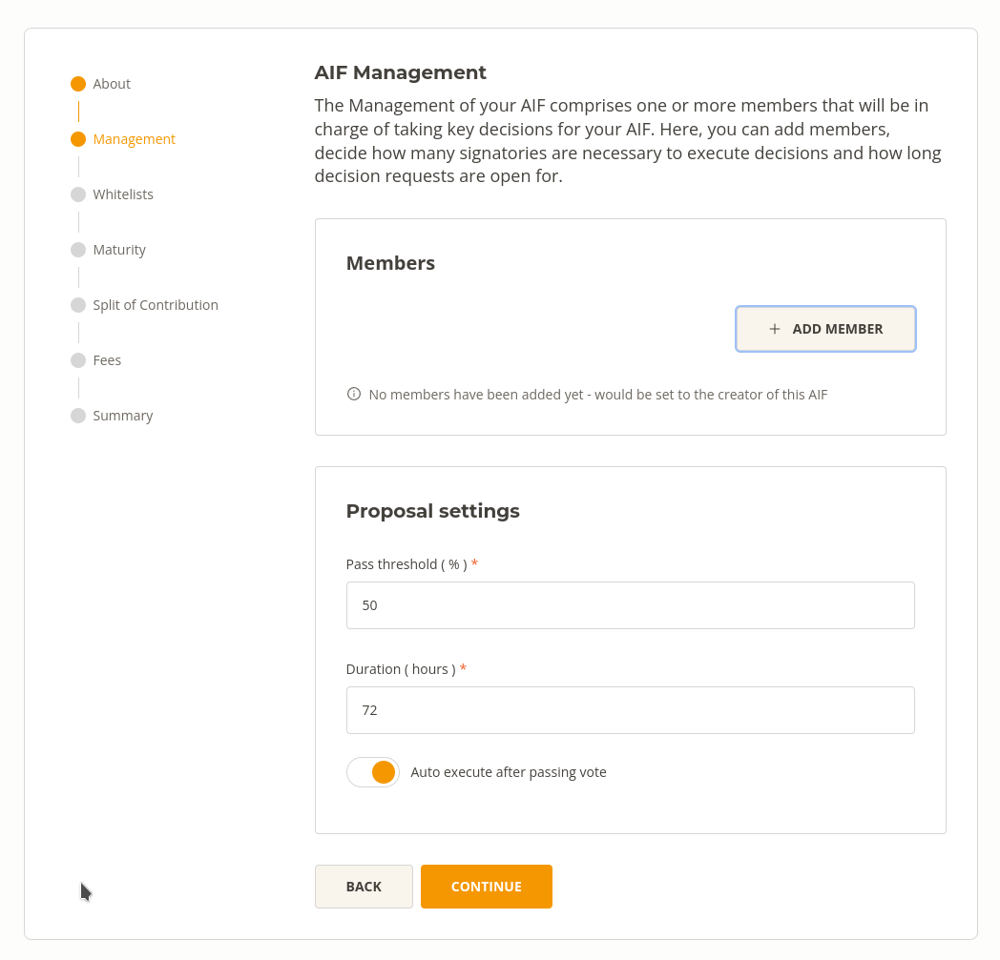
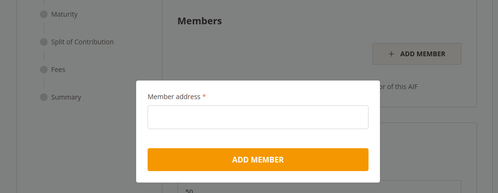
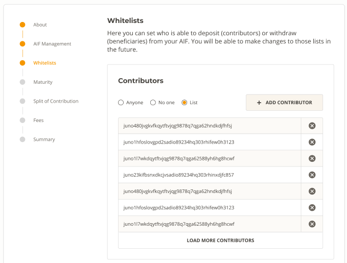
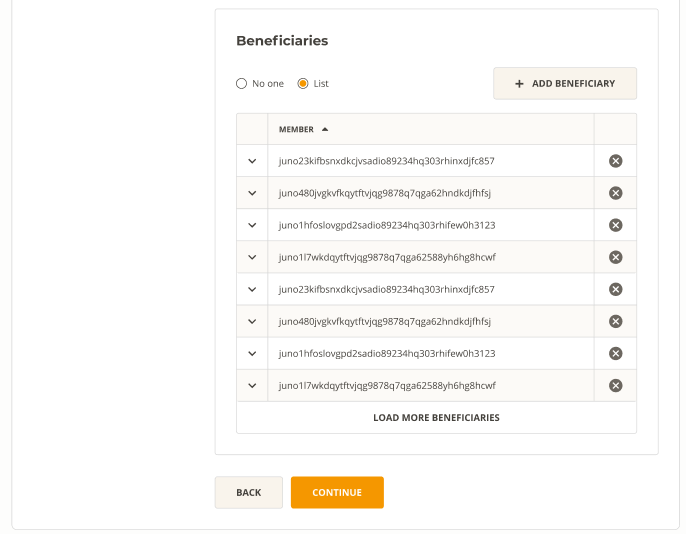
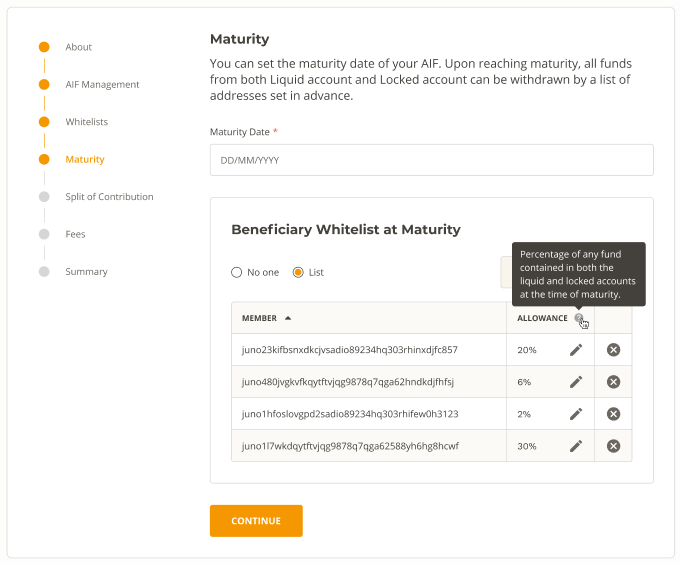
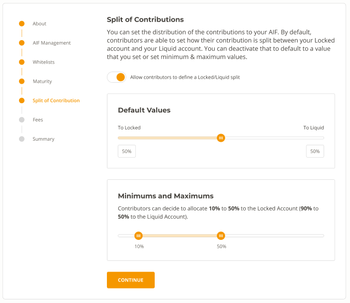
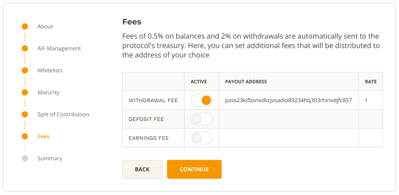
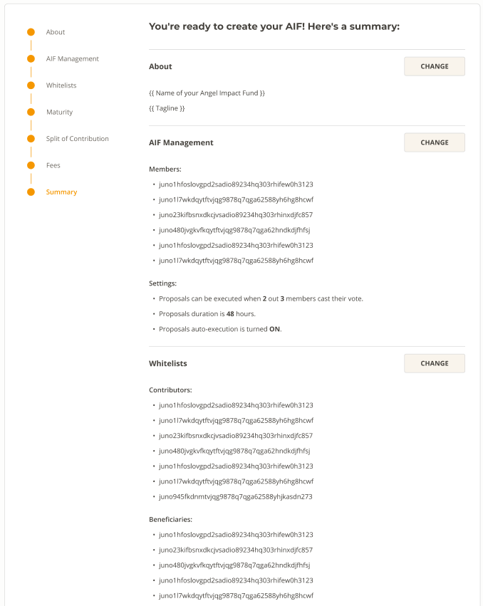
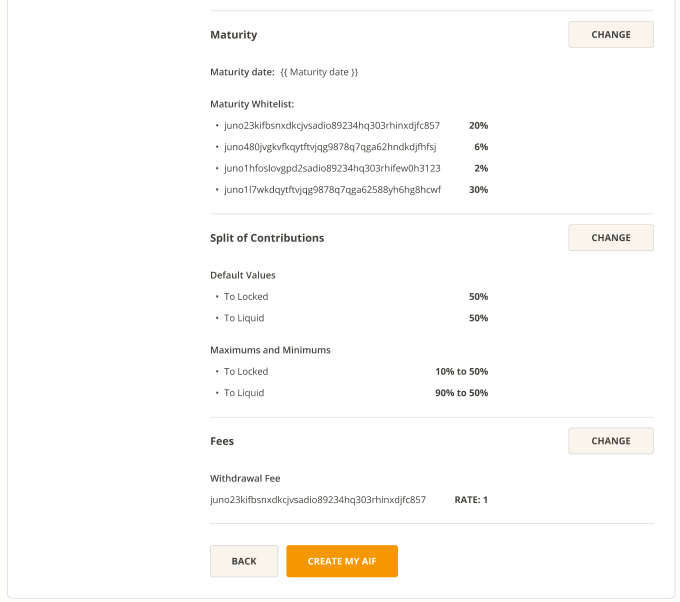

# Creating Your Angel Smart Treasury

> **What You Will Learn:** 
> - How to setup your wallet
> - How to create your AST
> - Setup options

## Step 1: Wallet Creation

You will need a tokenized asset wallet to interact with your AST. Already have a wallet for tokenized assets? Great, you are all set! Skip to the next section.
New to tokenized assets? No problem! You can quickly and easily set up your wallet with simply an email address using Web3Auth wallet.

## Step 2: About

Once you have your wallet setup, you are ready to begin creating your AST. In this section you can provide basic information like name and brief description/tagline.

## Step 3: AST Management Settings

Next you can setup the management of your AST. This determines your AST’s voting parameters and voting members. You must weigh security against operational efficiency when determining how many members are required to pass a vote (more members = more security, fewer members = more operational efficiency).

In the first section, you choose your AST members. In the second section, you choose the minimum required participation level, proposal duration, and whether proposals execute automatically once quorum is reached.

## Step 4: Whitelists (optional)

In this section you can choose who is able to deposit (contributors) or withdraw (beneficiaries) from your AST. You are not required to limit contributors or add beneficiaries, and you may change this at any time.

### Whitelisting Contributors

### Whitelisting Withdrawals

## Step 5: Maturity

If you’d like to set a maturity date/action for your AST, you may do so here. This is useful for any situation where you would like to release access of funds to specific beneficiaries at a specific time, such as when setting up trusts. It can also be used as a recovery fail-safe by setting up a separate recovery wallet as the beneficiary at a future date.

## Step 6: Split of Contribution

There may be situations where you would like AST funds split between locked (principal protected) & liquid (available) accounts. By default, contributors to your AST can choose how their contribution is split between these locked & liquid accounts. You may choose to modify that option here by setting default and minimum/maximum ranges, or deactivate it altogether.

## Step 7: Fees

In addition to our standard fees, you may choose to add additional fees on top. Fees can be applied to withdrawals, deposits, and/or on balances (i.e., AUM fees).

## Step 8: Summary

The final step before finishing creating your AST is reviewing the summary of settings prior to confirming.

## Step 9: Success!

Congratulations! You have successfully set up your AST & it is ready immediately for use.

