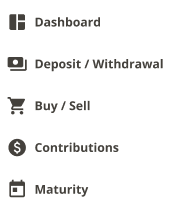
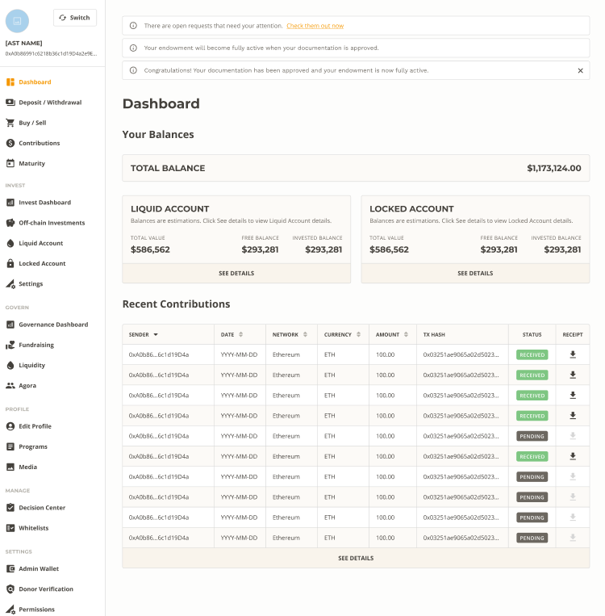
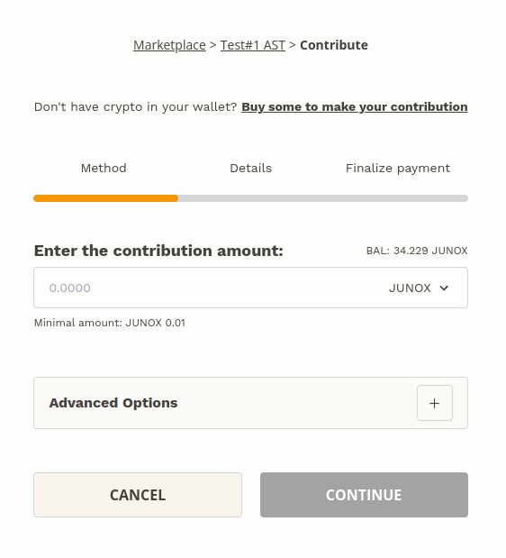
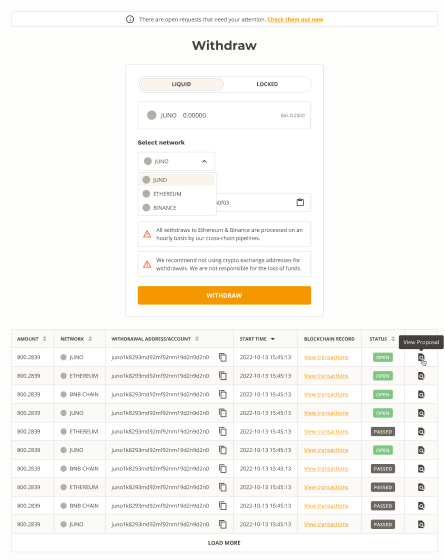
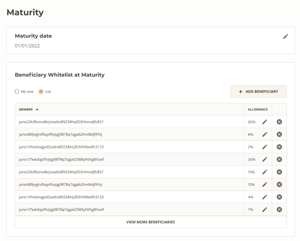

# Using Your Angel Smart Treasury

> **What You'll Learn:**
> - Understanding of AST dashboard view
> - Basics of using your new AST (Deposit/Withdrawal, Buy/Sell, Contributions, Maturity)

## AST Dashboard

Your AST dashboard provides an overview of your total account balances and recent contributions. The left-hand menu allows you to easily navigate to relevant sections. We will begin by going over some basics before diving deeper into specific functionality.

## Deposit / Withdrawal

### Deposit

Funding your AST is easy, whether transferring in existing tokenized assets or depositing from your bank or card. We utilize a network of on-ramp partners covering broad geographies. This section will allow you to deposit funds to be utilized for trading, investment, or simply non-custodial storage.

### Withdrawal

Withdrawals from your AST Liquid balance can be done at any time, pending a confirmation vote from your AST multisig's managing wallets. Simply select the currency & account you’d like to withdraw from, then choose the destination network & wallet.

> The ability to withdraw directly to your bank account is being added soon!

## Buy / Sell      

In this section you can buy & sell tokenized assets from your AST tokens on hand balances. To start this will allow us access to any approved tokens on UniSwap Protocol. We have plans expand this across all major blockchains thanks to our interchain partners Squid & Router Protocol!

## Contributions

This is where you can view all contributions into your AST and download, export, or filter contribution history.

## Maturity

If you’ve chosen to set up maturity for your AST, you can configure options here by adding/removing beneficiaries, updating allowance splits, or changing the maturity date.

