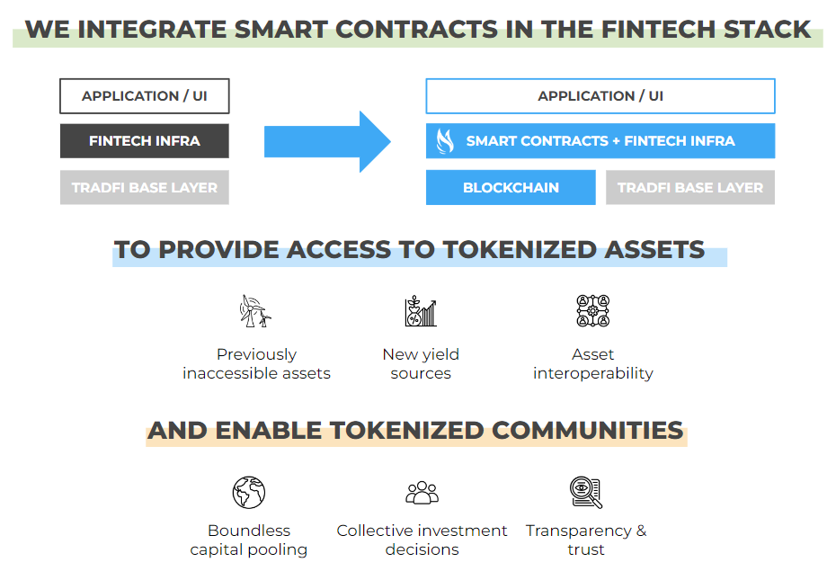

# What is Angel Protocol?

Angel Protocol provides fintech infrastructure that enables anyone to create & embed tokenized financial products in minutes with little to no coding required. When you build with us, you build on smart contracts that are executed on a blockchain network. This means that you don’t have to create and maintain accounts in the traditional financial system. We provide you with all the infrastructure and UI you need to interact in compliance with the financial system: fiat on/off-ramps, KYC, etc. These financial products are referred to as Angel Smart Treasuries and allow users to:
- Pool funds from around the world at low cost 
- Invest in a carefully curated set of tokenized assets
- Make collective investment decisions
- Mint tokens for collective ownership and fundraising
- Improve transparency & trust

Users can further set a variety of parameters to program their AST with no additional coding required:
- Define how funds are locked
- Set contributors and beneficiaries
- Set a maturity date and associated logic
- Set who has permissions to execute actions
- Lock forever any of these parameters

You don't need to be a blockchain expert to utilize ASTs. Communicating with smart contracts is as easy as any traditional API integration. Create your API request and configure your financial product in only a few minutes. Use our open-source components for your UI:
- Wallet connect & drop-down
- Cross-chain deposits
- Registration flow & on-boarding for your clients
- Fully-fledged marketplace & user profiles
- Management dashboard

> ⚠️ **Heads Up:** We have some great technical documentation if you want to go deeper, starting at [Technical Documentation - Introduction](../technical/introduction.md)

With Angel Protocol you can build or embed the ability to invest in tokenized assets & yield, coordinate using decentralized governance, and program trust-less execution in less than 60 minutes. We combine the best of tokenized infrastructure in one powerful but simple product, providing all the benefits of Web3 while abstracting away the complexity.
