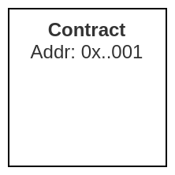
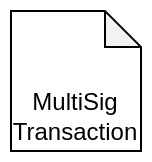

# Introduction

Welcome! I am excited you have decided to learn more about the Angel Smart Treasury (AST) from Angel Protocol. This document aims to help new develpers to understand the functionality and power offered by Angel Protocol’s smart contract platform so that they can quickly start building on top of us to deliver new and innovative financial solutions.

## ELI5: What is the purpose of an AST?

An AST provides you with the tools to fund-raise, coordinate, and invest capital in a transparent and friction-less manner. ASTs connect donors and investors with non-profits, social enterprises and other change-makers around the world. It’s a customizable, powerful, web3 infrastructure available in minutes!

## Who should read this book?

In our humble opinion, everyone should read this. That said, there are certain areas that will be more relevant to certain readers.

If you’re looking for a higher level overview of the Angel Protocol ecosystem you can check out that guide here [LINK]. We also provide a UI-focused guide for users that do not want or need to directly interact with the smart contracts and would prefer to use the provided web application for managing their AST.

If you are _not_ technically inclined, you should first read the [Functional Documentation](./functional/overview/main.md) chapters to get a complete understanding of what Angel Protocol is, what the ASTs can do, and how to work with the existing AngelProtocol.io website UI.

If you _are_ technically savvy or just want to dive deeper then the [Technical Documentation](./technical/overview/main.md) chapters are for you. These were written primarily with developers and tech-savvy users in mind. It will help if you come in with an understanding of how the Polygon blockchain (or a similar EVM-based blockchain such as  Ethereum) and Solidity smart contracts work. We’ll be diving deeper into the technical aspects of how to use the Angel Protocol smart contracts directly here.

Regardless of the path you chose, there is a lot to learn in the coming pages that will help you better understand and use our platform. Stick with it and you might be surprised!

## How to read this book?
Think of this book as a "Choose Your Own Adventure" format rather than a classic novel you need to read cover to cover.

This guide is written to provide explanations and details behind of ASTs and UI guides in our "Functional Documentation" sections. There we walk new users through how they can use our existing site to configure, launch, and manage their AST, all without a single line of code required!

In the "Technical Documentation" section of this book, we provide deeper explanations and breakdown the code behind ASTs using code snippets and contract interfaces that would be commonly encountered when using an AST programmatically. We have ordered the first sections to quickly orient users to the core logic and structures at play in the Angel Protocol contracts and Endowments that are important to understand first, we then dive into the AST creation process and the basics of using an AST multisig. With those foundations in place we build upon that, covering the various day-to-day scenarios that AST members can expect to encounter. Each section covers the overview of the setup, players and contracts involved, any important logic points or considerations. We will also look at relevant code snippets for the involved endpoints as well as any important structs as we go.


## Typographical Conventions Used

### Code Snippets

```javascript
function testAllTheThings() {
    // some 1337 code here...
}
```

### Important Points

> ⚠️ **Heads Up:** Important points will called out like this!

## Technical Diagram Symbols Used

| Symbol      | Description |
| ----------- | ----------- |
|  | Represents a smart contract on-chain. The "name" of the contract will always appear first in bold, along with an Address.       |
|  | Represents a single multisig contract transaction. These transactions are dependent on confirmation thresholds being reached to be executed. |
|  | Represents an interactive endpoint on a smart contract. Messages always point at the blue receptor and outward flowing arrows represent downstream actions. |
|  | Represents an EVM EOA wallet. |
|  | Represents a critical decision step in the contract logic. |
|  | This is money. 😄 It is used to represent the flow of tokens and resulting balances in a contract or wallet. |
